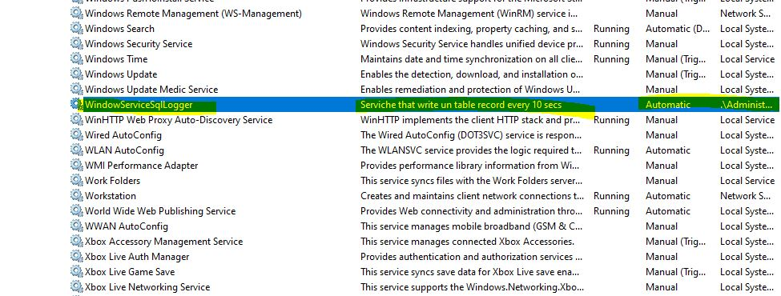
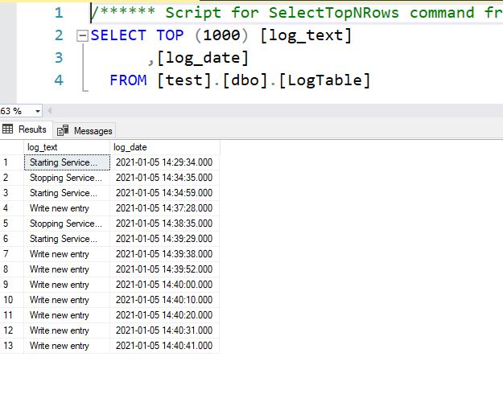

# WindowServiceSqlLogger
Este repositorio contiene un window service que escribe en un table de sql server logs al iniciar, cada 10 segundos, y al finalizar.

Ve a *LogDbClient.cs*
y cambia {your_connection_here}

Este proyecto esta basado en [Tutorial: Create a Windows service app](https://docs.microsoft.com/en-us/dotnet/framework/windows-services/walkthrough-creating-a-windows-service-application-in-the-component-designer)

Las pruebas realizadas son las siguientes:

Servicio instalado

Servicio escribiendo en base de datos

Cualquier otra cosa utilice los issues :D 📢 
